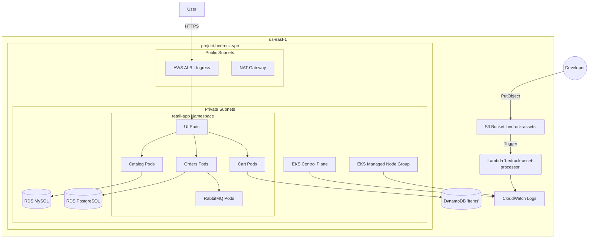

# Architecture Diagram

```mermaid
graph TD
    subgraph AWS Cloud [us-east-1]
        subgraph project-bedrock-vpc
            direction TB
            subgraph Public Subnets
                ALB[AWS ALB - Ingress]
                NAT[NAT Gateway]
            end

            subgraph Private Subnets
                EKS_CP[EKS Control Plane]
                EKS_NG[EKS Managed Node Group]
                
                subgraph retail-app Namespace
                    UI[UI Pods]
                    CATALOG[Catalog Pods]
                    ORDERS[Orders Pods]
                    CART[Cart Pods]
                    RABBIT[RabbitMQ Pods]
                end
                
                RDS_MYSQL[(RDS MySQL)]
                RDS_PG[(RDS PostgreSQL)]
            end
        end

        DYNAMO[(DynamoDB 'Items')]
        S3[S3 Bucket 'bedrock-assets']
        LAMBDA(Lambda 'bedrock-asset-processor')
        CW[CloudWatch Logs]
    end

    User -->|HTTPS| ALB
    ALB --> UI
    UI --> CATALOG
    UI --> ORDERS
    UI --> CART

    CATALOG --> RDS_MYSQL
    ORDERS --> RDS_PG
    ORDERS --> RABBIT
    CART --> DYNAMO

    Admin((Developer)) -->|PutObject| S3
    S3 -->|Trigger| LAMBDA
    LAMBDA --> CW
    EKS_CP --> CW
    EKS_NG --> CW
```
