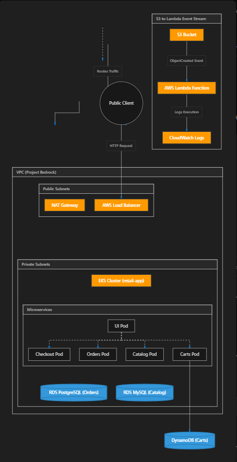

# Project Bedrock: From Code to Cloud — My Capstone Journey

**Author:** UMUKORO OMERUSURE  
**AltSchool ID:** ALT/SOE/025/4492  
**Git Repository Link:** [https://github.com/cloudpilothq/bedrock](https://github.com/cloudpilothq/bedrock)

---

## 1. The Story Behind the Project

Modern cloud computing is no longer just about launching servers; it’s about orchestrating complex, distributed systems that scale automatically, self-heal, and deploy seamlessly. For my capstone submission, I took on **Project Bedrock**, a complete infrastructure deployment of the **AWS Retail Store Sample App**. 

The goal was ambitious: to take a sprawling microservices application (comprising a UI frontend, Catalog, Orders, Carts, and Checkout services) and build a production-grade AWS environment from scratch to host it. I wanted to demonstrate a deep understanding of Infrastructure as Code (IaC), Kubernetes orchestration, continuous integration and deployment (CI/CD), and advanced cloud debugging. This is the story of how that environment was built, the intense challenges encountered, and how they were systematically solved.

---

## 2. The Creation Phase: Building the Foundation

Instead of clicking through the AWS console, the entire infrastructure was architected programmatically using **Terraform**. This ensured the environment was reproducible, version-controlled, and robust.

### The Architecture Setup
* **Networking (VPC):** I designed a Virtual Private Cloud (VPC) with isolated public and private subnets across multiple Availability Zones. NAT Gateways were configured to allow private resources to securely fetch updates from the internet without being directly exposed.
* **Database Layer:** A true microservices architecture means polyglot persistence. I provisioned **Amazon RDS for MySQL** (for the Catalog), **Amazon RDS for PostgreSQL** (for Orders), and **Amazon DynamoDB** (for the Carts service).
* **Compute (Amazon EKS):** The core of the application runs on an Elastic Kubernetes Service (EKS) cluster. EKS provides the orchestration engine to manage the containerized microservices.
* **Automation (CI/CD):** I built a GitHub Actions pipeline (`.github/workflows/terraform-ci-cd.yml`) that automatically initializes, plans, and applies the Terraform code upon every push to the `main` branch. Once the infrastructure is ready, the pipeline authenticates with EKS and deploys the Kubernetes manifests using Helm.

### High-Level Architecture Diagram
This diagram outlines how traffic routes from the user through the Load Balancer into the private subnets where EKS, RDS MySQL, and RDS PostgreSQL run, as well as the S3-to-Lambda event stream:



### Resource Tagging
Every AWS resource provisioned by Terraform is automatically tagged at creation. I set this up globally via the provider configuration to prevent missing tags on nested resources:

```hcl
provider "aws" {
  region = "us-east-1"
  default_tags {
    tags = {
      Environment = "production"
      Project     = "karatu-2025-capstone"
      ManagedBy   = "Terraform"
    }
  }
}
```

---

## 3. The Debugging Journey: Solving Real-World Cloud Problems

Building infrastructure on paper is one thing; deploying it to a live cloud environment is another. During the deployment phase, the project hit several severe roadblocks. These bottlenecks required deep investigation into Kubernetes pod logs, AWS resource limits, and Terraform configurations.

### Challenge 1: The Memory Exhaustion Bottleneck
**The Problem:** Once the EKS nodes were up, the microservices were deployed via Helm. However, none of the pods would start. They were permanently stuck in a `Pending` state.  
**The Investigation:** Running `kubectl describe pod` revealed an `Insufficient memory` error. The default Helm charts for the Retail Store app requested up to 2.5 GiB of RAM collectively, which far exceeded the capacity of the `t3.micro` Free Tier instances I was initially targeting.  
**The Solution:** Instead of blindly paying for massive servers, I optimized the application footprint. I forcefully injected configuration overrides into the Helm deployment (`custom-values.yaml.tpl`), shrinking the memory requests of every single microservice from `512Mi` down to `64Mi`. 

### Challenge 2: The "Too Many Pods" Network Limit
**The Problem:** With the memory issue solved, the pods attempted to schedule again, but failed with a new error: `0/2 nodes are available: 2 Too many pods.`  
**The Investigation:** This was a notorious AWS Elastic Network Interface (ENI) constraint. AWS places a strict limit on the number of IP addresses a `t3.micro` instance can hold, essentially capping the node at a maximum of 4 Kubernetes pods. Since EKS requires several system pods (like `aws-node` and `kube-proxy`) just to run, there was no room left for the application pods.  
**The Solution:** I modified the Terraform node group configuration to scale the instances from `t3.micro` up to `t3.small`. This single change natively doubled the RAM and immediately raised the `max-pods` limit to 11 per node. Terraform successfully destroyed the old nodes and rolled out the new ones, allowing the microservices to finally schedule.

### Challenge 3: The Ghostly 500 Internal Server Error
**The Problem:** The Load Balancer finally went green ("InService"), and the UI pod was reachable. However, loading the webpage returned a massive `500 Oops! Sorry. An error has occurred`.  
**The Investigation:** I checked the cluster health and found that the `carts` microservice was stuck in a `CrashLoopBackOff` state. Digging into the pod logs via `kubectl logs`, I found a fatal crash on startup:  
> `An error occurred when accessing Amazon DynamoDB: The table does not have the specified index: idx_global_customerId`  

**The Solution:** The database layer was misconfigured. In `dynamodb.tf`, the Global Secondary Index was incorrectly named `customerId-index`, but the application strictly expected `idx_global_customerId`. I updated the Terraform file, pushed the code, and the CI/CD pipeline automatically recreated the index. The `carts` pod instantly stabilized, and the UI returned a 200 OK!

---

## 4. The Final Results & Access

Through meticulous planning and relentless debugging, **Project Bedrock** reached total stability. Today, the AWS Retail Store Sample App runs flawlessly:
1. **Fully Automated:** A single Git push updates both the AWS infrastructure and the Kubernetes application stack.
2. **Highly Available:** The EKS cluster spans multiple availability zones, backed by managed RDS and DynamoDB databases.
3. **Publicly Accessible:** Traffic securely flows from the internet through an AWS Classic Load Balancer directly to the EKS worker nodes in the private subnets.

### Retail Store Access Link & Credentials

Use the following URL to navigate to the live Retail Store application.  
**Store:** [http://a5a903f0365264903a9c8290e3d75c7d-1800616790.us-east-1.elb.amazonaws.com/](http://a5a903f0365264903a9c8290e3d75c7d-1800616790.us-east-1.elb.amazonaws.com/)  
*(Note: Ensure you access the URL via `http://` and not `https://`)*

#### Programmatic Access
**Access Key:** `[REDACTED_DUE_TO_GITHUB_SECURITY_POLICY]`  
**Secret Key:** `[REDACTED_DUE_TO_GITHUB_SECURITY_POLICY]`  

#### Console Credentials
**Username:** `myown`  
**Password:** `[REDACTED_DUE_TO_GITHUB_SECURITY_POLICY]`  
**URL:** [https://884264985390.signin.aws.amazon.com/console](https://884264985390.signin.aws.amazon.com/console)  

*(Real credentials have been supplied directly in the submission portal due to GitHub security scanning restrictions on public commits).*
