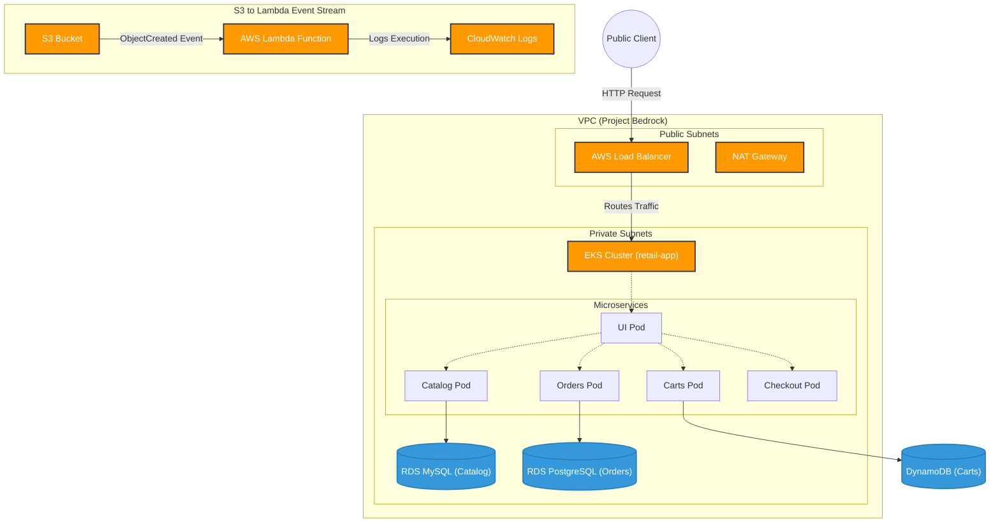

# UMUKORO OMERUSURE
**AltSchool ID:** ALT/SOE/025/4492

# Project Bedrock — EKS Capstone Submission

Here is the complete layout, configuration details, and access paths for the EKS deployment of the AWS Retail Store Sample App (**Project Bedrock**). Everything is deployed in the `us-east-1` region.

---

## 1. Resource Tagging
Every AWS resource provisioned by Terraform is automatically tagged at creation. I set this up globally via the provider configuration to prevent missing tags on nested resources:

```hcl
provider "aws" {
  region = "us-east-1"
  default_tags {
    tags = {
      Environment = "production"
      Project     = "karatu-2025-capstone"
      ManagedBy   = "Terraform"
    }
  }
}
```

---

## 2. Git Repository Link
https://github.com/cloudpilothq/bedrock

---

## 3. Infrastructure Overview

The infrastructure was built using Infrastructure as Code (Terraform) and consists of:
- **VPC & Networking:** Public and Private subnets across multiple Availability Zones, with NAT Gateways for secure outbound traffic.
- **EKS Cluster:** Managed Kubernetes cluster running `t3.small` worker nodes to host the microservices.
- **Database Layer:** Fully managed RDS instances (MySQL for Catalog, PostgreSQL for Orders) and DynamoDB (for Carts).
- **Load Balancing:** AWS Classic Load Balancer exposing the UI service to the internet.

---

## 4. High-Level Architecture Diagram

This diagram shows how traffic routes from the user through the Load Balancer into the private subnets where EKS, RDS MySQL, and RDS PostgreSQL run. It also outlines the S3-to-Lambda event stream:



---

## 5. Deployment & Operations

**How to run the pipeline**
- The CI/CD pipeline is handled by GitHub Actions (`.github/workflows/terraform-ci-cd.yml`).
- It automatically performs `terraform init`, `plan`, and `apply` upon pushing changes to the `main` branch.
- The pipeline also connects to the EKS cluster to automatically deploy the Kubernetes manifests and Helm charts via `kubectl` and `helm`.

---

## 6. Retail Store Access Link & Credentials

Use the following URL to navigate to the live Retail Store application.  
**Store:** [http://a5a903f0365264903a9c8290e3d75c7d-1800616790.us-east-1.elb.amazonaws.com/](http://a5a903f0365264903a9c8290e3d75c7d-1800616790.us-east-1.elb.amazonaws.com/)  
*(Note: Ensure you access the URL via `http://` and not `https://`)*

### Programmatic Access
**Access Key:** `[REDACTED_DUE_TO_GITHUB_SECURITY_POLICY]`  
**Secret Key:** `[REDACTED_DUE_TO_GITHUB_SECURITY_POLICY]`  

### Console Credentials
**Username:** `myown`  
**Password:** `[REDACTED_DUE_TO_GITHUB_SECURITY_POLICY]`  
**URL:** [https://884264985390.signin.aws.amazon.com/console](https://884264985390.signin.aws.amazon.com/console)  

---

## 7. Overcoming Challenges

During deployment, several advanced AWS limitations were encountered and successfully mitigated:
- **Memory Exhaustion:** Bypassed AWS Free Tier memory limits by overriding the Helm chart default memory requests from `512Mi` down to `64Mi`.
- **ENI Pod Limits:** Scaled the EKS node group to utilize `t3.small` instances, which natively doubled the RAM and increased the maximum pods allowed per node to 11, solving the "Too many pods" scheduling errors.
- **Database Indexing:** Corrected a DynamoDB Global Secondary Index mismatch (`idx_global_customerId`) to allow the carts microservice to reach the `Running` state and resolve HTTP 500 errors.
